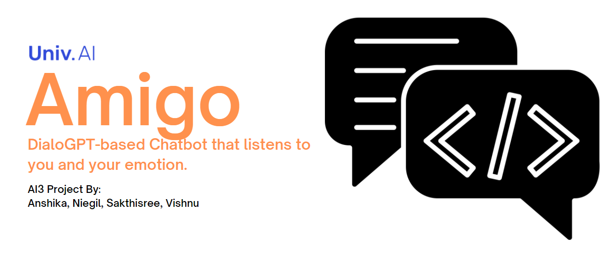

# AI3-Project - Amigo 

DialoGPT-based Chatbot that listens to you and your emotion. 

### Problem Statement
+ Most chat-bots that we have seen so far extract emotion from the text. Missing out on the tone in which the statement is put across. To tackle this, we have developed a chatbot that responds to the most important aspect of communication, ie. the tone.
+ Another challenge is bias in text data. In order to curb so, we looked at debiasing word embeddings from GLoVe to understand methodologies.

### Our Approach

We have built a chatbot that takes in the input of audio, accordingly responds based on emotion and content. Whilst doing so, we realized bias that existed in the responses. Hence, we also explored on how we could debias word embeddings, taking into account GLoVe embeddings. 

The models/algorithms we used included transfer learning of VGG16 for emotion detection, DialoGPT2 for chatbot responses and the neutralizing & equalizing algorithm for debiasing. We have also developed along the way an app that visually shows the embeddings in latent space.
